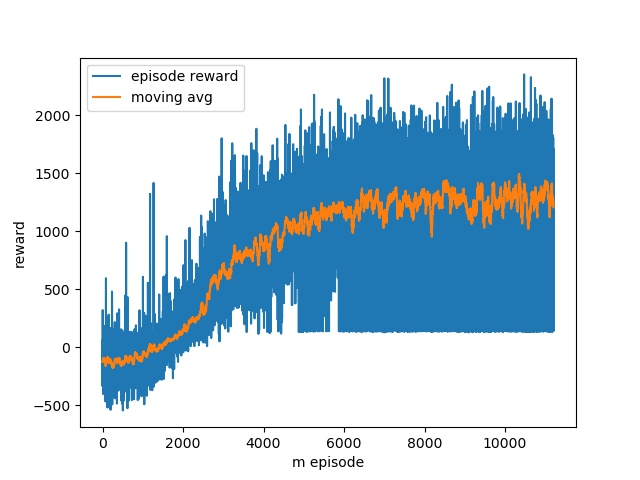

# falcon-nine-RL

## thrust vectoring nozzle

| Output  | Plotting result | Command |
| ------------- | ------------- | ------------- |
|   |  | Landing |

## task

**hovering and lading**. the rocket is simplified into rgid body into a 2d plane. i considered the basic
cylinder dynamics model and assumed the air resistance is propotional to the velocity. a thurst vectoring engine 
is installed at the bottom of the rocket. this engine provides adjustable thrust values with different direction. an angular 
velocity constraint is added to the nozzle with a max rotating speed of 30 degree per second.

- the distance between the rocket and the predefined target point - the closer they are, the larger
reward will be assigned
- the angle of the rocket body (the rocket should stay as upright as possible)

for the landing task : we look at the speed and angle at the moment of contact the ground. when the touching speed
are smaller than a safe threshold and the angle is close to 0 degree, we see it as a successful landing and a big
reward be assigned. the rest of the rules are the same as the hovering task

| Hovering Output  | Plotting result | Command |
| ------------- | ------------- | ------------- |
|   |  | Hover |

episode reward finally converges very well after over 20421 episode.
